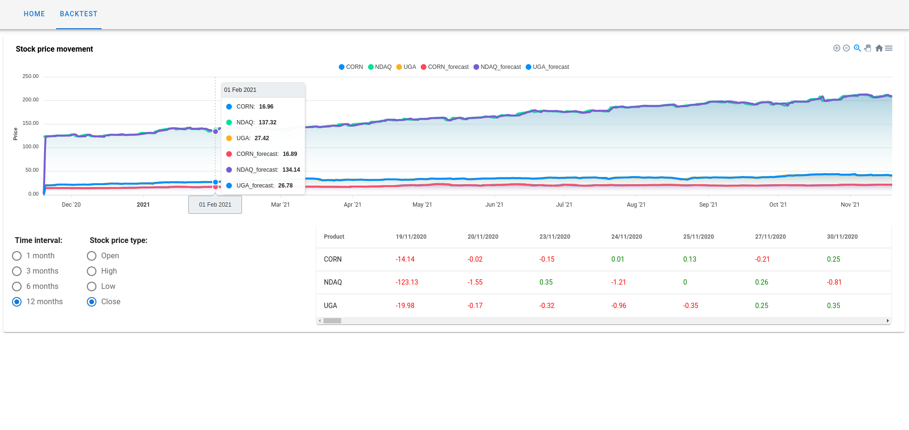

# Dev Assignment Example

Dev assignment example of a Web Application for Data Analysis and Visualisation.

## Description

The aim of the project is to collect, visualise and forecast financial data using Python.
In particular, we download stock prices for Corn, Gasoline and Nasdaq and we plot them on the same chart, where at least 1 month of data is available.
In addition, a table shows the next day price forecast for each stock.

## Architecture

* BE: Flask server, which retrieves and processes the financial data.
Price forecasts are generated using an [ARIMA model](https://en.wikipedia.org/wiki/Autoregressive_integrated_moving_average).
* FE: Vue.js, for data analysis and visualization. It also allows you to set which time interval and price type to analyze.
Chart library used: [ApexCharts](https://apexcharts.com/). FE designed for a minimum target resolution equal to full HD.

## Screenshots
* Home


* Backtest


## Prerequisites
Local environment setup guide for Ubuntu OS.

### Python3 & pip3 installation

```
sudo apt install python3 python3-distutils python3-pip python3-dev build-essential
```

### Node & npm installation

```
sudo apt install nodejs npm
```

### Docker installation

* Please see this [reference](https://docs.docker.com/engine/install/ubuntu/)
* If unable to run docker without "sudo", refer to [this](https://docs.docker.com/engine/install/linux-postinstall/)
* Docker compose installation:

```
sudo apt install docker-compose
```

## Dev setup

### BE

```
cd be
pip3 install -t lib -r requirements.txt
```

### FE

```
cd fe
npm install
```

### Node/npm compatibility issues
In case of any compatibility issue, please delete the package-lock.json file inside the fe folder.
You can also refer to the installed version on local env:

```
node --version 
v15.14.0
npm --version
7.7.6
```

## Dev run

### BE

```
cd be/src
python3 main.py
```

### FE

```
cd fe
npm run serve
```

## Docker

### BE

```
docker build -t dev-assignment-be ./be
docker run --rm --name dev-assignment-be -p 5000:5000 dev-assignment-be:latest
```

### FE

```
docker build -t dev-assignment-fe ./fe
docker run --rm --name dev-assignment-fe -p 8080:8080 dev-assignment-fe:latest
```

### Docker compose
Alternatively, you can use docker compose:

```
docker build -t dev-assignment-be ./be
docker build -t dev-assignment-fe ./fe
docker-compose up
```
